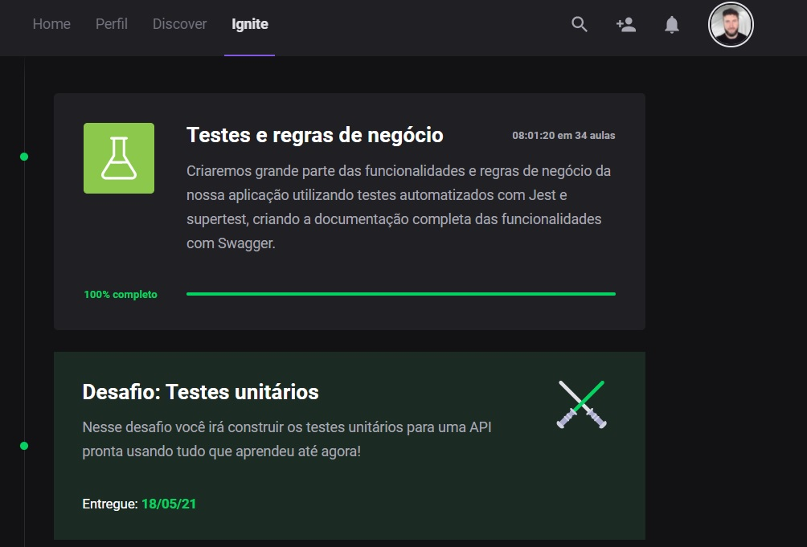
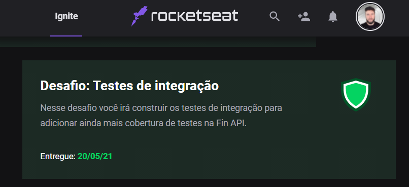

# 🔥 Ignite - Trilha NodeJS

<h3 align="center">
  Desafio 01 e 02- Testes unitários e Testes de integração
</h3>




## :rocket: Sobre o desafio

Nesse desafio, você deverá criar testes unitários e testes de integração para a aplicação FinAPI, já utilizada em outros módulos da trilha Node.js

### :keyboard: Instalação e Execução do Projeto

- Clone este repositório

```
> git clone {url-do-repositorio}
```

- Navegue até o diretório principal do projeto

```
> cd IGNITE-TESTS-CHALLENGE
```

- Instale as dependências com o Yarn

```
yarn
```

- Rode a suite de testes

```
yarn test
```

- Execute o projeto

```
yarn dev
```

## :eyeglasses: Instruções sobre o que deve ser feito

Existe uma documentação no Notion sobre as rotas e testes,
clique Desafio 01 **[aqui](https://www.notion.so/Desafio-01-Testes-unit-rios-0321db2af07e4b48a85a1e4e360fcd11)** 

clique Desafio 02 **[aqui](https://www.notion.so/Desafio-02-Testes-de-integra-o-70a8af48044d444cb1d2c1fa00056958)** para acessar!

## Testes Unitários

- [X] should be able to create a new user

- [X] should not be able to create a user with an email already registered

- [X] should be able to authenticate user

- [X] should not be able no authenticate a nonexistent user

- [X] should not be able to authenticate user with incorrect password

- [X] should be able to show user profile

- [X] should be able to create a new deposit

- [X] should be able to create a new withdraw

- [X] should not be able to create a new withdraw with insufficient funds

- [X] should be able to get user balance

- [X] should be able to show user profile


## Testes de Integração

- [] should be able to create a new user

- [] should not be able to create a new user when email has already been registered

- [] should be able to authenticate user

- [] should be able to show user profile


## :memo: Licença

Esse projeto está sob a licença MIT. Veja o arquivo [LICENSE](https://github.com/git/git-scm.com/blob/master/MIT-LICENSE.txt) para mais detalhes.

---

Feito com ♥ by [Julio Moraes](https://www.linkedin.com/in/j%C3%BAlio-c%C3%A9sar-ambos-moraes-2685381ba/)
